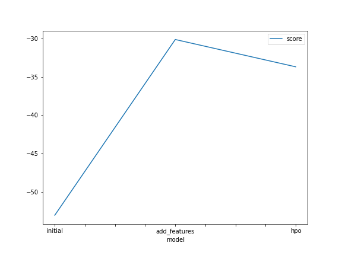
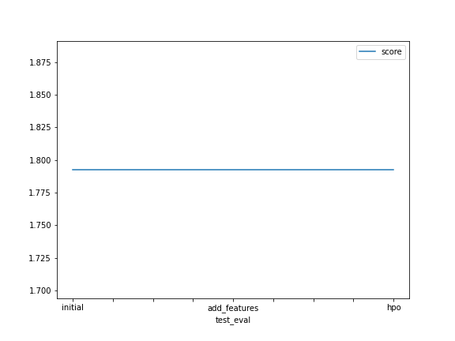

# Report: Predict Bike Sharing Demand with AutoGluon Solution
#### NAME HERE

## Initial Training
### What did you realize when you tried to submit your predictions? What changes were needed to the output of the predictor to submit your results?
I noticed that in all checks for negative values there were none but i still added a check to make sure.
I had to manually install kaggle.
I had to create dataframes at the EDA and the hyperparameter tuning sections otherwise i would get a declaration error for submission_new_features and submission_new_hpo

### What was the top ranked model that performed?
TODO: Add your explanation

## Exploratory data analysis and feature creation
### What did the exploratory analysis find and how did you add additional features?
From plotting histograms at the exploratory data analysis (eda) step, I deduced that :
temp, atemp, humidity, windspeed are normally distributted, season, weather are categorical and
holiday and  working day features are binary

I added the hour feature to the data which gave the model more to work with the hour of the day helped determine which hours of the day have a high bike demand.

### How much better did your model preform after adding additional features and why do you think that is?
test error (root mean square logarithmic error rmsle) decreased from 1.80346 to 0.69969 which is also a huge improvement in performance.

I believe the increase in perfomance is due to the fact that the hour feature gives the trained models more insight into which hours in the day the bike share demand rose or went down. The data was collected based on the hours of the day so the hour feature showed a clear pattern of trends in the data.

## Hyper parameter tuning
### How much better did your model preform after trying different hyper parameters?
TODO: Add your explanation

### If you were given more time with this dataset, where do you think you would spend more time?
TODO: Add your explanation

### Create a table with the models you ran, the hyperparameters modified, and the kaggle score.
|model|hpo1|hpo2|hpo3|score|
|--|--|--|--|--|
| initial      | default_vals                                                                                                                                                                                    | default_vals                                                                                                                                                                         | default_vals                                                                                                                                             |  1.79039|
| add_features | default_vals                                                                                                                                                                                    | default_vals                                                                                                                                                                         | default_vals                                                                                                                                             | 0.69969 |
|hpo|GBM (Light gradient boosting) : num_boost_round: [lower=100, upper=500], num_leaves:[lower=6, upper=10], learning_rate:[lower=0.01, upper=0.3, log scale], applying random search with 5 trials | XGB (XGBoost): n_estimators : [lower=100, upper=500], max_depth : [lower=6, upper=10], eta (learning_rate) : [lower=0.01, upper=0.3, log scale] applying random search with 5 trials | CAT (CATBoost) : iterations : 100, depth : [lower=6, upper=10], learning_rate  : [lower=0.01, upper=0.3, log scale] applying random search with 5 trials |  |

### Create a line plot showing the top model score for the three (or more) training runs during the project.

TODO: Replace the image below with your own.

### Create a line plot showing the top kaggle score for the three (or more) prediction submissions during the project.

TODO: Replace the image below with your own.

## Summary
TODO: Add your explanation
